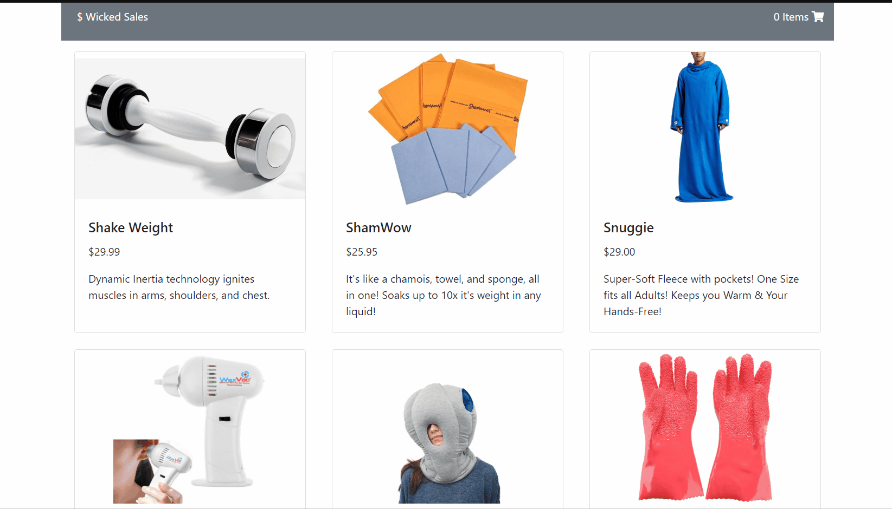

# wicked-sales-js
> - Maintained by: `kusholhuq`

## Description
A full stack Node.js and React shopping cart app.

## Live Demo
https://wicked-sales-js.kusholhuq.com/


## Technologies Used
  - React.js
  - Babel
  - Webpack 4
  - Bootstrap 4
  - Node.js
  - Express
  - Express - session
  - PostgreSQL
  - HTML5
  - CSS3
  - JavaScript (ES6)


  ## Features
 1. User can view the products for sale
 1. User can view the details of a product
 1. User can add a product to their cart
 1. User can view their cart summary
 1. User can place an order

 ## Preview
 

 ## Development
 ### System Requirements
 - Node.js 10 or higher
 - NPM 6 or higher
 - PostgreSQL 12 or higher
 ### Getting Started
 1. Clone the repository
    ``` bash
    git clone https://github.com/kusholhuq/wicked-sales-js
    cd wicked-sales-js
    ```
 1. Install all dependencies with NPM
    ``` bash
    npm install
    ```
 1. Import the database schema
    ``` bash
    npm run db:import
    ```
 1. Start pgweb in a separate terminal
    ``` bash
    pgweb
    ```
 1. Start the Express.js server in server/index.js and webpack-dev-server in parallel.
    ``` bash
    npm run dev
    ```
 1. Once started you can view the application by opening http://localhost:3000 in your browser.
